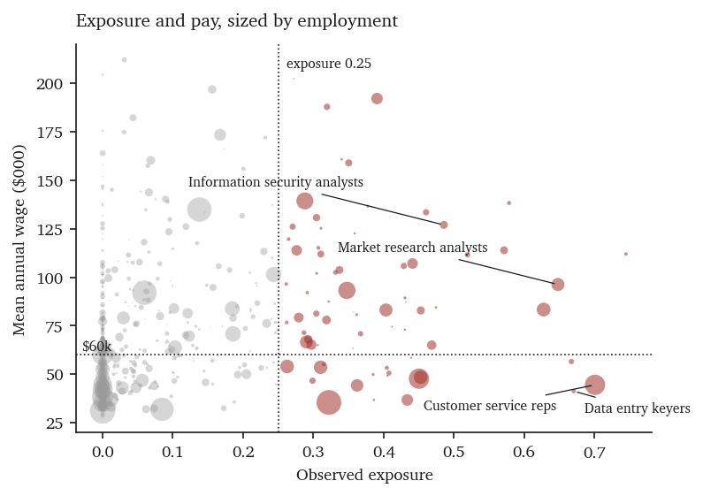
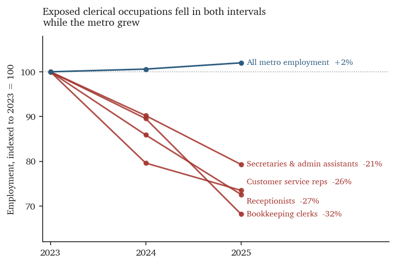
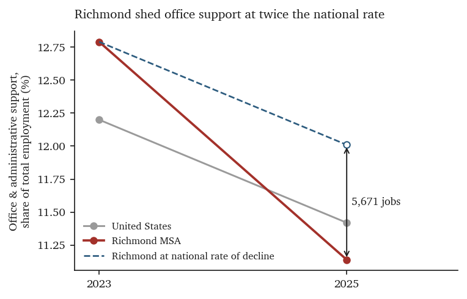
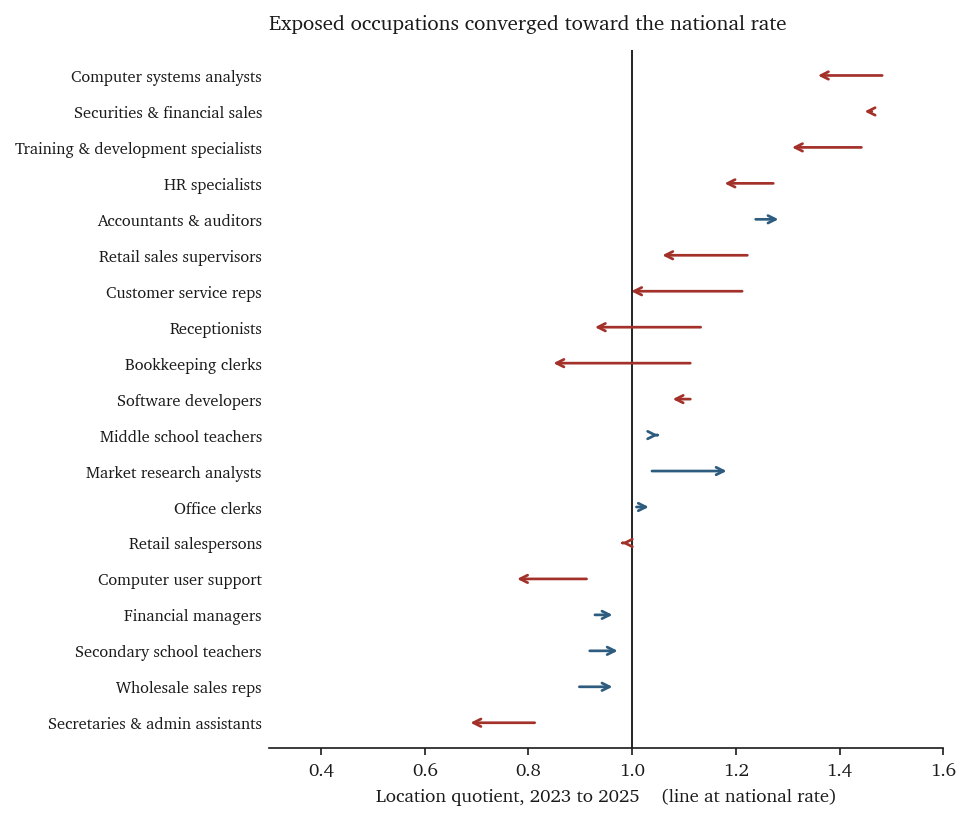
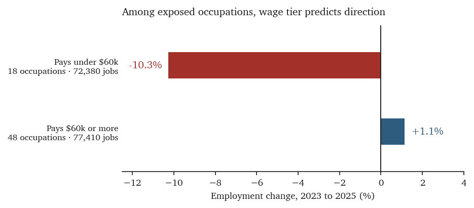
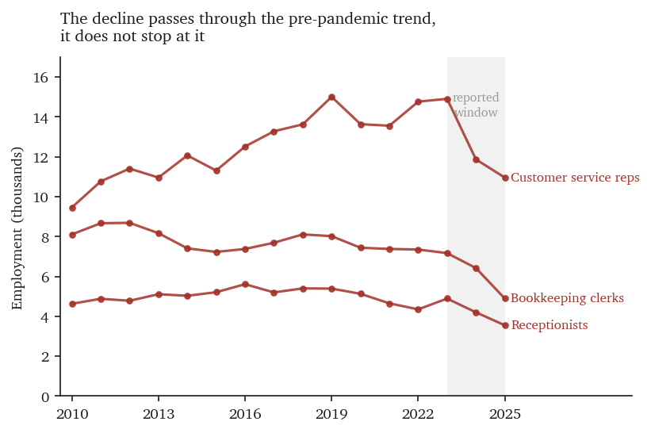

# AI Exposure and Employment Change in the Richmond Metropolitan Area

**Occupation-level evidence, May 2023 – May 2025**

Prepared for the Richmond AI Workforce Working Group
July 2026

Supporting tables, the full occupation list, and reproduction instructions are in
the accompanying [Technical Appendix](technical-appendix.md).

---

## Summary of findings

1. **Richmond's overall AI exposure is close to the national average — 2.3% above it.**
   The region's employment-weighted mean exposure is 0.1360 against a national 0.1329.
   Because exposure scores are national constants applied to both areas, this entire
   gap is occupational composition rather than any Richmond-specific intensity.

2. **Three clerical occupations contracted sharply. Exposed work as a whole did not.**
   Customer service representatives fell 26.5%, bookkeeping clerks 31.8% and
   receptionists 27.4%, together shedding **7,570 jobs** while metropolitan employment
   grew 2.0%. Each of the three declines is five to nine times the survey's own
   sampling error, and each carries the occupation below where it stood a decade
   earlier. Exposed occupations moved in both directions, however: thirteen fell across
   both survey intervals and fifteen rose, so the **net change across exposed
   occupations that moved consistently is −4,570 jobs**, against a gross decline of
   10,800. Exposure does not predict whether an occupation declined — 19.7% of exposed
   occupations fell in both intervals against 17.4% of everything else, a difference
   well inside chance. Section 8 reports these tests in full, including the ones that
   go against the finding.

3. **That contraction erased Richmond's over-concentration in exposed clerical
   occupations.** Twelve exposed occupations fell from above-national to at-or-below
   national concentration between 2023 and 2025, together shedding 10,180 jobs.
   Customer service representatives moved from a location quotient of 1.22 to 0.99.
   Richmond's low aggregate exposure gap today is partly a consequence of these jobs
   having already left.

4. **What remains over-concentrated is professional and high-wage.** Twenty-seven
   occupations combine exposure at or above 0.25 with a location quotient at or above
   1.10. They account for 41,510 jobs at a mean wage of $97,096 and a combined annual
   wage bill of $4.03 billion. Their employment has been essentially flat, not falling.

5. **Wage tier, not exposure score, separates the two groups.** Among exposed
   occupations, those paying under $60,000 contracted 10.3% between 2023 and 2025
   while those paying $60,000 or more grew 1.1%. Identical exposure scores accompany
   opposite employment trajectories.

6. **Exposed work pays more than unexposed work, but not uniformly.** Occupations at
   or above 0.25 exposure average $76,905 against $55,419 for those at or below 0.05,
   a 38.8% premium. Within the exposed range the relationship reverses: mean wage peaks
   at $95,066 in the 0.10–0.25 band and falls to $65,346 above 0.60, because the most
   exposed occupations of all are clerical.

---

## 1. Data and method

### 1.1 Sources

**Exposure scores.** Anthropic's occupational exposure dataset assigns each Standard
Occupational Classification code an **Anthropic-observed task exposure** value between 0
and 1, representing the share of that occupation's tasks appearing in measured
interactions with its models. The published file covers 756 occupations. Scores are
national and derived from usage rather than from expert judgment about automatability.
The longer name is used on first reference and shortened to "exposure" thereafter; it is
retained here because the measure is narrower than the term "AI exposure" implies.

Three inputs sit inside that score, and all three are combined by Anthropic before
publication: the O\*NET task taxonomy, which establishes what tasks constitute each
occupation; Anthropic's own usage data, which supplies the observed numerator; and the
task-level capability bounds of Eloundou et al. (2023). This analysis consumes the finished
score and combines none of them independently. Everything the Bureau of Labor Statistics
supplies below — employment, wages, location quotients — enters as denominator and context
and never touches the exposure value.

This measure is built from interactions with one provider's models. Anthropic publishes
no geographic or enterprise-segment breakdown, so the share of Richmond employers' AI
activity represented in it is unknown. Usage occurring through other ecosystems is not
captured — Microsoft Copilot most importantly, because it is embedded in the office
software supporting the clerical tasks central to this analysis. Comparable occupational
measures exist, notably Microsoft's Tomlinson et al. (2025) from Bing Copilot
conversations and the capability-based estimates of Webb (2020), Felten et al. (2021)
and Eloundou et al. (2024), and both the Budget Lab at Yale and the Economic Innovation
Group have documented that these measures disagree substantially at the occupation level,
partly because crosswalks between occupational codes and task inventories introduce
measurement error of their own. The occupational rankings in this report should therefore be
read as specific to this measure. The aggregate patterns, and the wage separation in Section 5
in particular, are the more transportable findings.

Observed usage is also not the same as capability. Anthropic's own work puts actual
workplace integration at roughly one-third of theoretical capacity, which is the single
most useful calibration for reading any figure below.[^calibration]

**Employment, wages, and location quotients.** Bureau of Labor Statistics Occupational
Employment and Wage Statistics, May 2025, for the Richmond, VA Metropolitan Statistical
Area (area code 40060) and for the United States. Earlier vintages are the May 2024 and
May 2023 releases.

**Employer headcounts.** Greater Richmond Partnership, *Largest Employers, Richmond, VA
MSA*, updated February 2026.

### 1.2 Construction

The Richmond May 2025 release lists 598 detailed occupations. Joining these to the
exposure dataset on SOC code yields 523 occupations that carry an employment figure, a
wage, a location quotient, and an exposure score, and that are also separately measured
at the national level. These 523 occupations account for 584,030 jobs, or 88.4% of the
metropolitan total of 660,350.

Seventy-five occupations carrying 56,020 jobs, 8.5% of metropolitan employment, fall
outside that set. They are dropped for having no counterpart in the exposure file or no
separately measured national figure, never for scoring low. The exclusions nonetheless
bias the measured mean upward, because the largest of them is Home Health and Personal
Care Aides at 11,570 jobs, a physical-presence occupation almost certain to score at or
near zero. If every excluded job scored zero, metropolitan mean exposure would be
**0.1241 rather than the 0.1360 reported in Section 2**. That is a lower bound, and the
true value lies between the two.

Exposure scores are a single national vintage applied unchanged to all three employment
years, so only employment varies over time in this analysis. This is deliberate. It means
changes in any provider's market share cannot produce apparent movement in exposure,
because exposure has no time dimension here. It also means the analysis makes no claim
about whether AI exposure is growing, and it should not be cited as measuring that.

Employment, wages, and location quotients are drawn from a single release, so no figure
in the cross-sectional analysis mixes vintages. As an independent check, the May 2025
employment values were compared against the same figures retrieved through the BLS
Public Data API; the two sources agree exactly for every occupation.

The national comparison uses measured national employment for the same 523 occupations.
Because both means are computed over one occupational universe with one set of exposure
scores, the difference between them reflects only the difference in employment
composition.

### 1.3 Thresholds

Two thresholds recur. Exposure of 0.25 marks the boundary of the analysis's "exposed"
category; it is a chosen cut point, not a value Anthropic designates as meaningful, and
it sits well above the metropolitan mean of 0.136. It falls at the 86th percentile of
occupations and separates 143,640 jobs above from the remainder below.

A location quotient compares how concentrated an occupation is locally against how
concentrated it is nationally. A value of 1.00 means Richmond employs that occupation at
exactly the national rate for a metropolitan area of its size; 1.10 means 10% more than
expected, and 0.90 means 10% fewer. The 1.10 cut point is therefore a modest
over-representation, chosen because it is far enough above 1.00 to exclude rounding and
sampling noise while still admitting occupations that are only somewhat concentrated.

Both cut points are analytical conventions, so the findings are recomputed across a range
of alternatives.[^sensitivity] Both are also reported alongside the underlying continuous
values so that readers can apply different ones; the appendix carries the full
distribution.

---

## 2. Aggregate exposure

| | Value |
|---|---:|
| Occupations analyzed | 523 |
| Employment covered | 584,030 |
| Share of metropolitan employment | 88.4% |
| Exposure-weighted jobs | 79,400 |
| Richmond mean exposure | 0.1360 |
| National mean exposure | 0.1329 |
| Richmond relative to national | **+2.3%** |

The aggregate gap is small, and on its own it would suggest Richmond faces an
unremarkable degree of exposure. The average conceals the structure that matters.

Four occupational groups hold 75.6% of the region's total exposure while employing
33.8% of covered workers:

| Group | Employment | Exposed jobs | Mean exposure | Share of exposure | Mean wage |
|:-------------------------|-----------:|-------------:|--------------:|------------------:|----------:|
| Office & admin support | 71,030 | 23,603 | 0.332 | 29.7% | $50,539 |
| Sales | 52,780 | 14,167 | 0.268 | 17.8% | $51,808 |
| Business & financial | 49,740 | 13,893 | 0.279 | 17.5% | $91,242 |
| Computer & mathematical | 23,940 | 8,397 | 0.351 | 10.6% | $117,369 |

Sorted by exposure band rather than occupational group, the concentration is sharper
still. The 24.6% of covered employment in occupations scoring 0.25 or above accounts for
73.7% of the region's total exposure. The 3.8% scoring above 0.60 — 22,120 jobs — carries
18.7% of it.

At the other end, the groups anchoring Richmond's largest employers are close to
unexposed. Healthcare practitioners average 0.054, healthcare support 0.011, and
transportation and material moving 0.001. Registered nurses score 0.059; licensed
practical nurses and nursing assistants score 0.000.

Across all analyzed occupations, the annual wage bill is $40.1 billion, of which
$6.2 billion — 15.6% — is attached to exposed tasks.

---

## 3. Finding 1: three clerical occupations contracted sharply

### 3.1 Occupations declining across both intervals

Twelve occupations with exposure at or above 0.25 fell in both the 2023–2024 and
2024–2025 intervals. Requiring decline in both intervals reduces the chance that a
movement rests on one anomalous survey panel, though it does not eliminate it.[^panels]

| Occupation | 2023 | 2024 | 2025 | Change | Pct | Exposure | Wage |
|:-----------------------------------|-----:|-----:|-----:|------:|-----:|-----:|-----:|
| Customer service representatives | 14,910 | 11,870 | 10,960 | −3,950 | −26.5% | 0.701 | $44,520 |
| Bookkeeping & auditing clerks | 7,170 | 6,420 | 4,890 | −2,280 | −31.8% | 0.310 | $53,580 |
| Receptionists & information clerks | 4,890 | 4,200 | 3,550 | −1,340 | −27.4% | 0.434 | $36,750 |
| Interviewers, except eligibility | 1,000 | 460 | 230 | −770 | −77.0% | 0.385 | $49,870 |
| Computer user support specialists | 2,690 | 2,520 | 2,350 | −340 | −12.6% | 0.469 | $64,990 |
| Operations research analysts | 1,300 | 1,070 | 1,020 | −280 | −21.5% | 0.429 | $105,800 |
| Graphic designers | 1,000 | 960 | 760 | −240 | −24.0% | 0.367 | $70,860 |
| Data entry keyers | 590 | 530 | 480 | −110 | −18.6% | 0.671 | $41,270 |

Four smaller occupations complete the set. Together the twelve lost **9,510 jobs**,
representing approximately **$476 million in annual wages** valued at 2025 rates.

Occupations below the 0.25 threshold also declined, and in absolute terms they lost more.
Seventy-two of them fell across both intervals, shedding **10,910 jobs** against the
twelve exposed occupations' 9,510. What separates the two groups is rate rather than
volume: the exposed decliners lost 26.8% of their 2023 employment, the non-exposed
decliners 13.7%. Widening the comparison from decliners to all occupations points the
same way — the 66 occupations at or above 0.25 that can be measured across the whole
window netted −4.4%, while the 416 below it grew 2.9%.

Two things qualify that aggregate, and Section 8 sets out both in full. It is carried
almost entirely by the occupations already named: removing customer service
representatives and bookkeeping clerks moves it from −4.4% to −0.2%, and removing
receptionists as well turns it positive. And the screen producing the table above finds
nearly as much movement in the opposite direction — fifteen exposed occupations rose
across both intervals, adding 6,230 jobs, against the thirteen that fell. Net of both
sides, exposed occupations that moved consistently account for −4,570 jobs. What these
data support is a concentration of loss in a few large occupations, not a general
contraction of exposed work.

Within office and administrative support, the group at the centre of this finding, the
split is visible directly. Eleven of its occupations score at or above 0.25; five of
them grew. Office clerks, general — 10,890 jobs at an exposure of 0.450, the largest
exposed clerical occupation in the region after customer service representatives — was
slightly up over the period, and medical secretaries, at 0.362, grew by 1,900. Whatever
distinguishes the three contracting occupations from these, it is not the exposure
score.

Two entries in this table should be read with caution. Interviewers fell from 1,000 to
230, a decline too steep on a base that small to represent an orderly economic process,
and it is more likely to reflect a coding or sampling change.[^smallbase] Health
specialties teachers, in the four smaller occupations, declined only 3.4%.

A thirteenth occupation meets the screen and is deliberately excluded. Secretaries and
administrative assistants fell 1,290, but the adjacent medical-secretary code grew
1,900 over the same period, and the four-code secretarial cluster nets **+440** in
Richmond. Medical secretaries grew 28.3% nationally while general secretaries fell
4.4%, so this pattern appears in the national data as well. The most credible reading
is a shift of administrative work toward healthcare, combined with recoding, rather
than work that disappeared. That inference rests on the national direction of travel
rather than on direct evidence from Richmond employers, and confirming it means asking
the region's health systems whether administrative headcount grew and under what
titles. Pending that, excluding the decline is the more conservative treatment.

Customer service representatives carry particular weight: at 0.701 they are among the
most exposed occupations in Anthropic's dataset, and Richmond lost more of them in
absolute terms than any other occupation.

### 3.2 Netting the national trend out of each occupation

A decline that matches the national rate is not a regional finding. Applying each
occupation's national rate of change to its 2023 Richmond employment gives the level
national conditions alone would predict; the gap is the part specific to Richmond.

| Occupation | Richmond | National | Excess | Exposure |
|:-----------------------------------|--------:|--------:|-------:|-------:|
| Bookkeeping & auditing clerks | −31.8% | −8.5% | −23.3 | 0.310 |
| Receptionists & information clerks | −27.4% | −9.3% | −18.1 | 0.434 |
| Customer service representatives | −26.5% | −9.2% | −17.3 | 0.701 |
| Graphic designers | −24.0% | −7.0% | −17.0 | 0.367 |
| Computer user support specialists | −12.6% | +4.0% | −16.6 | 0.469 |
| Operations research analysts | −21.5% | −7.9% | −13.6 | 0.429 |
| Technical writers | −18.2% | −5.1% | −13.0 | 0.474 |
| Data entry keyers | −18.6% | −17.6% | −1.0 | 0.671 |

Of the 9,510 jobs lost, national rates of change account for 2,707. The remaining
**6,803 jobs are specific to Richmond**. Restricting the calculation to the eight
occupations with at least 1,000 jobs in 2023, which removes the small bases where
sampling noise dominates, leaves 6,639 of that excess intact — the finding does not
depend on the volatile small occupations.

Two cautions attach to that figure. The national rate is a single point estimate with
no variance attached, so an excess measured against it establishes how far Richmond
sits from the national average, not whether that distance is unusual. Occupational
employment changes vary widely across metropolitan areas — for a single occupation the
spread across metros routinely runs to tens of percentage points — so showing that
Richmond is genuinely an outlier requires the distribution of comparable areas rather
than the national mean alone. That test is not run in this report and is the single
most valuable extension of it.

The group-level shortfall in Section 3.4 arrives at a similar 5,671 jobs by a different
route, using employment shares rather than rates of change. The two are not independent
confirmations of each other: both anchor on the same national figures, so their
agreement is closer to arithmetic than to corroboration.

One case runs against the pattern and is important. Data entry keyers, the
second-most-exposed occupation in the dataset at 0.671, declined at essentially the
national rate. The occupation with the largest Richmond-specific excess is bookkeeping
clerks, at an exposure of 0.310. Within this set, exposure score does not order the
size of the regional effect,[^ordering] which is consistent with the wage pattern in
Section 5 and inconsistent with a simple account in which higher exposure produces
proportionally faster local decline.

### 3.3 The office and administrative support group

| | May 2023 | May 2024 | May 2025 |
|---|---:|---:|---:|
| Matched detail occupations | 79,650 | 74,270 | 70,870 |
| BLS major-group total | 82,810 | 77,260 | 73,590 |
| Share of metropolitan employment | 12.79% | — | 11.14% |
| Location quotient | 1.048 | — | 0.976 |

*The two employment rows differ because the first sums the 41 detail occupations matched
to exposure scores and the second is the BLS published group total, which includes
occupations without exposure scores. Both decline; the detail series falls 11.0%.*

Metropolitan employment grew 2.0% over the same period, from 647,440 to 660,350. The group's location
quotient crossed below 1.0, meaning Richmond moved from employing office support at
above the national rate to below it.

### 3.4 Netting out the national trend

Office support contracted nationally as well, from 18,533,450 to 17,753,430 jobs, a
share decline from 12.20% to 11.42%.

| | Share change, 2023–2025 |
|---|---:|
| United States | −0.79 points |
| Richmond MSA | −1.65 points |
| Ratio | **2.09×** |

Applying the national rate of decline to Richmond's 2023 share yields a counterfactual
of 79,261 office-support jobs in May 2025 against an actual 73,590. The
**Richmond-specific shortfall is 5,671 jobs** beyond what national conditions explain.
Richmond shed office-support employment at slightly more than twice the national rate.

### 3.5 The concentration that disappeared

Twelve occupations with exposure at or above 0.25 held location quotients at or above
1.10 in 2023 and fell below 1.10 by 2025. Their combined employment went from 45,970 to
35,790, a loss of **10,180 jobs**.

| Occupation | LQ 2023 | LQ 2025 |
|---|---:|---:|
| Customer Service Representatives | 1.22 | 0.99 |
| Bookkeeping, Accounting & Auditing Clerks | 1.12 | 0.84 |
| Receptionists & Information Clerks | 1.14 | 0.92 |
| Medical Records Specialists | 1.43 | 0.89 |
| Interviewers, Except Eligibility and Loan | 1.47 | 0.37 |
| First-Line Supervisors of Retail Sales Workers | 1.23 | 1.05 |

This is the mechanism behind the modest aggregate gap reported in Section 2. Richmond's
exposure profile converged toward the national profile, and it converged by losing the
jobs that had distinguished it.

---

## 4. Finding 2: the remaining concentration is professional and high-wage

Twenty-seven occupations combine exposure at or above 0.25 with a 2025 location quotient
at or above 1.10.

| | Value |
|---|---:|
| Occupations | 27 |
| Employment, May 2025 | 41,510 |
| Share of covered employment | 7.1% |
| Share of metropolitan exposure | 20.5% |
| Mean wage, employment-weighted | $97,096 |
| Combined annual wage bill | $4,030,435,400 |

The largest by wage bill:

| Occupation | 2023 | 2025 | Change | LQ | Exposure | Wage |
|:-----------------------------------|------:|------:|-------:|-----:|---------:|---------:|
| Accountants & auditors | 7,540 | 7,920 | +5.0% | 1.29 | 0.348 | $93,210 |
| Market research & marketing analysts | 3,720 | 4,550 | +22.3% | 1.19 | 0.648 | $96,240 |
| Human resources specialists | 4,880 | 4,540 | −7.0% | 1.17 | 0.403 | $83,110 |
| Computer systems analysts | 3,160 | 2,990 | −5.4% | 1.35 | 0.276 | $113,840 |
| Securities & financial services sales | 3,010 | 2,990 | −0.7% | 1.44 | 0.441 | $107,070 |
| Information security analysts | 1,650 | 1,690 | +2.4% | 2.09 | 0.486 | $126,940 |
| Personal financial advisors | 1,880 | 1,350 | −28.2% | 1.19 | 0.350 | $158,910 |
| Operations research analysts | 1,300 | 1,020 | −21.5% | 2.22 | 0.429 | $105,800 |
| Database architects | 390 | 440 | +12.8% | 1.53 | 0.579 | $138,240 |

Twenty-five of the twenty-seven can be tracked to 2023. Their combined employment
changed by −30 jobs, or −0.1%: eleven grew, adding 1,870 jobs, thirteen declined,
losing 1,900, and one was unchanged.

This set is not contracting. That distinguishes it sharply from the clerical
occupations in Section 3 and is the reason this finding is stated as an open question
rather than a projection. Richmond's deepest exposure concentrations now sit in
occupations that have held their employment through the period in which the clerical
occupations lost a fifth to a third of theirs.

Several of these concentrations are pronounced. Information security analysts run at
2.09 times the national rate, operations research analysts at 2.22, administrative law
judges at 2.96, and database administrators at 2.00. These are also among the region's
better-paid occupations, ranging from roughly $80,000 to $159,000.

---

## 5. What separates the two groups

Exposure score alone does not predict employment change. Sorting exposed occupations by
wage does.

| Exposed occupations (exposure ≥ 0.25) | Occupations | 2023 | 2025 | Change |
|---|---:|---:|---:|---:|
| Paying under $60,000 | 18 | 72,380 | 64,950 | **−10.3%** |
| Paying $60,000 or more | 48 | 77,410 | 78,300 | **+1.1%** |

Cumulative thresholds obscure a further point: the relationship between exposure and pay
reverses at the top of the distribution. Reported by band rather than cumulatively, mean
wage rises with exposure to a peak in the 0.10–0.25 band and then falls.

\needspace{10\baselineskip}

| Exposure band | Occupations | Jobs | Mean wage |
|:--------------|------------:|-----:|----------:|
| 0.00 – 0.05 | 319 | 285,590 | $55,419 |
| 0.05 – 0.10 | 54 | 67,050 | $74,948 |
| 0.10 – 0.25 | 79 | 87,750 | **$95,066** |
| 0.25 – 0.40 | 43 | 81,900 | $83,015 |
| 0.40 – 0.60 | 22 | 39,620 | $70,731 |
| 0.60 and above | 6 | 22,120 | $65,346 |

Bands are closed at the upper bound, matching the distribution table in the appendix.

The most heavily exposed occupations are not the best paid. They are routine ones, and
the wage premium reported in the summary is driven by the middle of the distribution
rather than its top.

The two groups carry comparable exposure scores. Market research analysts, at 0.648,
are more exposed than every clerical occupation in Section 3 except customer service
representatives and data entry keyers, and they grew 22.3%. Data entry keyers, at 0.671,
fell 18.6%.

Two readings are consistent with this pattern, and the data here cannot separate them.
Exposure may translate into task augmentation in occupations with broad
responsibilities and into task substitution in occupations built around a narrow set of
routine tasks.[^taskconc] Alternatively, the professional occupations may simply be
earlier in the same adjustment, with their employment yet to respond.[^turnover] A third
possibility cannot be ruled out from these data: if employers retitle contracting
clerical roles into professional codes, the same pattern would appear without any
underlying change in the work.[^retitle]

The distinction matters for program design. Under the first reading, the professional
concentrations in Section 4 call for capability-building inside existing roles. Under
the second, they identify the next 41,510 jobs to come under pressure — at a mean wage
more than double that of the clerical jobs already lost. The evidence in this report
does not settle which applies, and any program built on one reading should be designed
to detect if the other is correct.

---

## 6. Employer context

Greater Richmond Partnership's February 2026 employer list provides headcounts, though
not occupational composition. No employer publishes an occupational breakdown, so the
mapping from employer to exposure is inference and is presented as such.[^employers]

Two distinct kinds of estimate meet in this section and should not be conflated.
Occupational employment is a BLS survey estimate with published sampling error. Employer
headcounts are published company totals covering all occupations, with no occupational
breakdown. Nothing here is a measurement of any employer's own AI usage: the exposure
scores attached to an employer below are national occupational averages, not observations
of that firm.[^firmlevel]

| Employer | Employees | Function |
|---|---:|---|
| Capital One | 14,000 | Financial services, call center |
| VCU Health | 13,500 | Health care |
| HCA Virginia Health System | 11,200 | Health care |
| Bon Secours Richmond | 8,516 | Health care |
| Virginia Commonwealth University | 7,832 | Public university |
| Dominion Energy | 5,433 | Headquarters, energy services |

The region's three largest health systems and its university employ occupations that
score at or near zero exposure. These institutions are the regional ballast.

Capital One's occupational base runs the opposite direction. Every occupation
characteristic of its footprint sits above the metropolitan mean of 0.136: customer
service representatives at 0.701, market research analysts at 0.648, financial analysts
at 0.572, information security analysts at 0.486, software developers at 0.288.

Beneath the largest employers, Richmond hosts a dense customer-contact sector. General
Dynamics employs 1,450 in a call center, The Results Companies 936, SimpliSafe 836 in
customer support, Comcast 675, Allianz Global Assistance 650, and Teleperformance 590 in
financial services customer support — roughly 5,100 jobs in operations the employer list
identifies explicitly as call center or customer support work, before counting the
unsized call-center share of Capital One's 14,000.

This is the most direct available explanation for why customer service representatives
were a Richmond-specific vulnerability. The occupation is Anthropic's second-most
exposed; the region employed it at 1.22 times the national rate in 2023; and the
regional employer base is unusually weighted toward the operations that use it.

The employer list excludes government and retail operations, so it understates total
regional employment and omits some large public employers.

---

## 7. Absorption capacity

Where displaced clerical workers can go is constrained by what the low-exposure segment
of the regional economy pays. Customer service representatives averaged $44,520 in 2025.

Destinations that pay more, with existing regional employer bases:

| Occupation | Employment | Wage | LQ | Exposure |
|---|---:|---:|---:|---:|
| First-Line Supervisors, Construction Trades | 4,460 | $79,030 | 1.29 | 0.030 |
| Licensed Practical & Vocational Nurses | 2,570 | $66,110 | 0.93 | 0.000 |
| Electricians | 3,600 | $62,360 | 1.12 | 0.000 |
| Automotive Service Technicians | 2,930 | $61,160 | 0.98 | 0.000 |
| Heavy & Tractor-Trailer Truck Drivers | 11,760 | $60,130 | 1.34 | 0.000 |
| Heating, Air Conditioning & Refrigeration Mechanics | 2,700 | $58,490 | 1.55 | 0.019 |

Destinations frequently proposed that pay less:

| Occupation | Employment | Wage | Exposure |
|---|---:|---:|---:|
| Medical Assistants | 3,210 | $43,060 | 0.048 |
| Nursing Assistants | 6,660 | $41,770 | 0.000 |
| Landscaping & Groundskeeping Workers | 4,360 | $39,940 | 0.000 |
| Fast Food & Counter Workers | 17,100 | $31,080 | 0.000 |

The first group requires credentials and, in the trades, apprenticeship time. The
second is largely accessible without them. A transition program that does not fund the
credential gap will route workers to the second group, which is a wage reduction.

Heating and air conditioning mechanics warrant note: exposure near zero, a wage above
the customer service average, and a location quotient of 1.55 indicating the employer
base is already concentrated here.

---

## 8. Robustness

The tests below are the first ones a skeptical economist would run against Section 3.
They are reported here whether or not they support it, because a reader who runs them
independently and finds them absent has good reason to distrust everything else. Two of
them substantially narrow what Section 3 can claim. Two others rule out explanations
that would otherwise account for it.

Every figure in this section is recomputed from the published source data rather than
carried forward from the analysis above.

### 8.1 Leverage: the aggregate is three occupations

The −4.4% aggregate for exposed occupations does not survive the removal of its largest
contributors.

| Exposed occupations, 2023–2025 | Net change |
|:---|---:|
| All 66 | −4.37% |
| Less customer service representatives | −1.92% |
| Less bookkeeping clerks as well | −0.24% |
| Less receptionists as well | **+0.84%** |
| Less secretaries as well | +1.99% |

Three occupations account for 7,570 of the jobs and for the entire aggregate. Beyond
them the exposed group is flat to growing. This is why the finding is stated as three
named occupations rather than as a property of exposed work, and why the aggregate
figure should not be quoted on its own.

### 8.2 The mirror screen: exposed occupations also grew

Selecting occupations that fell in both survey intervals feels like corroboration, but
under sampling noise alone two consecutive moves in the same direction occur about a
quarter of the time in each direction. The screen is only informative if it finds more
in one direction than the other. Run in reverse:

| Set | Occupations | Fell in both | Jobs | Rose in both | Jobs | Net |
|:---|---:|---:|---:|---:|---:|---:|
| Exposure ≥ 0.25 | 66 | 13 | −10,800 | 15 | +6,230 | **−4,570** |
| All others | 413 | 72 | −10,910 | 88 | +21,810 | +10,900 |

Fifteen exposed occupations rose consistently across the same period in which thirteen
fell. Section 3.1's headline of 9,510 jobs holds secretaries out of the falling side;
on that same basis the net is −3,280.

### 8.3 Base rates: exposure does not change the odds of decline

Section 3 establishes that some exposed occupations fell a long way. It does not
establish that exposed occupations were more likely to fall.

| Test | Exposed | All others | Fisher exact |
|:---|---:|---:|---:|
| Declined 2023–2025 | 50.0% | 40.6% | p = 0.18 |
| Fell in both intervals | 19.7% | 17.4% | p = 0.61 |

Neither difference is distinguishable from chance. Nor does exposure predict the size of
the change: across 482 occupations the correlation between exposure score and percentage
employment change is Pearson −0.023 (p = 0.62) and Spearman −0.074 (p = 0.10). The
finding lives entirely in the magnitude of a few declines, which returns to 8.1.

### 8.4 Sampling error: the three named declines are real

OEWS publishes a relative standard error with every estimate. Applied to the three
occupations the report names, and treating the vintages as independent, which is
conservative:

| Occupation | 2023 | 2025 | Change | RSE 2023 | RSE 2025 | z |
|:---|---:|---:|---:|---:|---:|---:|
| Customer service representatives | 14,910 | 10,960 | −3,950 | 2.1 | 2.8 | −9.0 |
| Bookkeeping & auditing clerks | 7,170 | 4,890 | −2,280 | 1.9 | 5.1 | −8.0 |
| Receptionists & information clerks | 4,890 | 3,550 | −1,340 | 3.0 | 5.9 | −5.2 |

These are not sampling artifacts. Whatever explains them, it is not survey noise. The
same cannot be said of every occupation in Section 3.1's table: the smaller entries sit
on bases where a single anomalous panel moves the estimate, which is why the report's
claims rest on the three above.

### 8.5 The sixteen-year baseline rules out post-pandemic normalization

Normalization is the strongest competing explanation available, and it makes a testable
prediction: employment inflated during the 2021–2022 hiring surge should fall back to
the pre-pandemic trend and stop there. Extending the panel to May 2010 tests it
directly.

Customer service representatives grew from 9,460 in 2010 to a peak of 15,010 in 2019,
fell during the pandemic, recovered to 14,910 by 2023, and now stand at 10,960 — their
2013 level. The recovery was complete before the decline began, so there was no
inflated level to unwind. Bookkeeping clerks never surged at all: the occupation sat
between 7,000 and 8,700 for thirteen consecutive years before falling to 4,890, lower
than in any year since 2010. Receptionists are also below their entire prior range.

Normalization can explain a return to trend. It cannot explain passing through the
trend and continuing.

### 8.6 The metropolitan boundary changed, but not enough to matter

OEWS adopted the 2023 OMB delineation with the May 2024 release, having used the 2017
delineation through May 2023. Richmond lost Caroline County and gained King and Queen
County in the change, so the 2023 and 2025 vintages do not describe identical
geographies.

Holding the county set fixed and recomputing covered employment from the Quarterly
Census of Employment and Wages shows the effect is a level shift of about 5,000 jobs,
between −0.69% and −0.87% of the metropolitan total, and close to constant across every
year from 2019 to 2025. A near-constant sub-1% shift in the denominator cannot produce
a 26.5% decline in a single occupation. The boundary change is real and is disclosed
here; it is not a candidate explanation for Section 3.

### 8.7 What the industry data does and does not corroborate

OEWS has no industry dimension and QCEW has no occupational dimension, so neither can
confirm the other directly. What QCEW can show, on a fixed county set, is whether the
industries employing these occupations moved consistently with the occupational story.

| Industry, fixed geography | 2023 | 2025 | Change |
|:---|---:|---:|---:|
| Total, all industries | 648,239 | 667,860 | +3.0% |
| Credit intermediation (NAICS 522) | 8,364 | 6,910 | −17.4% |
| Finance and insurance (NAICS 52) | 27,263 | 25,110 | −7.9% |
| Accounting, tax prep & bookkeeping (NAICS 5412) | 7,735 | 7,271 | −6.0% |
| Business support services (NAICS 5614) | 4,712 | 5,231 | **+11.0%** |

The first three are consistent with the occupational finding: the industries that
employ Richmond's back-office and bookkeeping workers contracted while the region grew,
and credit intermediation has fallen 46.6% since 2019. The last is not. Business
support services is the industry containing call-center operations, and it grew 11%
over precisely the period in which customer service representatives fell 26.5%. That is
an awkward fact for the reading in Section 6, which attributes the occupation's decline
partly to Richmond's concentration of customer-contact operations.

Two readings survive it. Employers may be retaining call-center establishments while
reducing headcount per establishment, or shifting staff there into other occupational
titles. Alternatively the occupational decline may be concentrated in the in-house
customer service functions of banks and insurers, which QCEW counts under finance
rather than under business support. Both are testable against employer records and
neither is settled here. The series also carries 52 suppressed county-year cells, so its
level is understated by an unknown amount, though suppression is unlikely to reverse the
direction.

### 8.8 The same screen on a period before generative AI

The screen behind Section 3.1 can be run on earlier three-vintage windows. Occupations
are classified by their current exposure score throughout, so the question is whether
the work that scores high today was already declining in periods when no language model
could have touched it.

| Window | Occupations scored | Exposed | Fell in both | Rose in both | Exposed | All others | Gap |
|:---|---:|---:|---:|---:|---:|---:|---:|
| 2013–2015 | 362 | 47 | 9 | 12 | +1.56% | +2.68% | −1.12 |
| 2015–2017 | 348 | 47 | 6 | 15 | +2.39% | +3.36% | −0.97 |
| 2017–2019 | 343 | 46 | 8 | 13 | −1.44% | +3.63% | **−5.08** |
| 2019–2021 | 367 | 49 | 15 | 3 | −2.53% | −8.26% | +5.72 |
| 2021–2023 | 448 | 63 | 12 | 18 | +1.17% | +6.14% | −4.97 |
| 2023–2025 | 479 | 66 | 13 | 15 | −4.37% | +2.85% | **−7.21** |

Two things follow, and they point in opposite directions.

The count of exposed occupations falling across both intervals is unremarkable. Thirteen
did so in 2023–2025, against fifteen in 2019–2021 and twelve in 2021–2023. Any argument
resting on the number of declining exposed occupations is therefore not supported: that
number is ordinary.

The gap between the exposed group and everything else is the largest in the series at
−7.21 points, which is the strongest quantitative case in this report that the current
window is distinctive. But a gap of −5.08 appeared in 2017–2019, before generative AI
was publicly available, and −4.97 in 2021–2023. The current gap is the largest observed;
it is not different in kind from what this metropolitan area produced twice before
without AI. During the pandemic the relationship inverts entirely, with exposed
occupations outperforming the rest by 5.72 points.

Comparability across these windows is imperfect. The number of occupations carrying both
a published figure and an exposure score rises from 343 to 479 over the series, the
2013–2017 windows use SOC 2010 codes against SOC 2018 for the later ones, and the
exposure measure postdates every window it is applied to. The windows are best read as
indicative rather than as a controlled comparison.

### 8.9 What each finding can carry

The findings in this report do not all bear the same weight, and anyone presenting the
work should know which is which before being asked.

**Defensible under challenge.** The wage separation in Section 5, which holds at every
exposure cut point tested, from a 41% premium at 0.20 to 18% at 0.60. The three named
declines in Section 3, each many times its own sampling error and each carrying the
occupation below its position a decade earlier. The non-monotonic relationship between
exposure and pay, where mean wage peaks in the middle of the exposure distribution
rather than at the top. And the coverage and method statements in Section 1.

**Exploratory, and to be labelled as such.** The Richmond-specific excess in Section 3.2,
which is measured against a national point estimate rather than the distribution of
comparable metropolitan areas. Employer-level attribution in Section 6, since no employer
publishes occupational composition and the mapping is inference from industry staffing
patterns. And the count of exposed workers, which is specific to one measure and one
threshold rather than a population figure.

**Not supportable from these data.** That exposure predicts which occupations decline;
Section 8.3 tests this directly and rejects it. That the contraction is a general
property of exposed work rather than a concentrated loss in three occupations. And any
causal attribution of the declines to AI: this analysis establishes co-occurrence in
three occupations, and the confounders in Section 9 are individually sufficient to
explain a substantial part of the same pattern.

Three terminology cautions follow. "Exposed" is not a synonym for "at risk," because
exposure means tasks appear in model interactions and some of that is augmentation.
Employer-level figures carry no implied precision. And the occupational rankings are the
most quotable part of this report and the least transportable, because published
comparisons of exposure measures find they diverge substantially at the occupation level.

### 8.10 What would change the conclusion

Three findings would materially undermine Section 3. First, a cross-metropolitan
comparison placing Richmond's declines inside the normal distribution of metro-level
change for these occupations — the test named in Section 3.2 and not yet run. Second,
employer confirmation that the work continues under different occupational titles, which
would convert the decline into reclassification, as already appears to be the case for
secretaries. Third, evidence that a small number of large employers relocated or
consolidated specific operations, which would make this a firm-level event rather than
an economy-wide one.

The first of these is the highest priority for anyone extending this work, and none of
the three requires access to data this analysis could not obtain.

Two further pieces of work would settle questions this report leaves open rather than
overturn it. Rank-correlating these exposure scores against the other published
occupational measures would establish how much of Section 3's occupational detail is
specific to this one, which matters because the rankings are the most quotable part of
the report. And occupational headcount from two or three large employers would convert
Section 6 from inference to measurement; that section is the weakest in the report and
the data exists, but only the employers hold it.

---

## 9. Limitations

1. **OEWS is not designed for cross-year comparison.** BLS states this directly.
   Estimates change with sampling, occupational reclassification, and methodological
   revision as well as with employment, and the metropolitan boundary itself changed
   between the 2023 and 2025 vintages, as Section 8.6 sets out. Section 3's findings
   rest on such comparisons. What makes the direction credible is that the three named
   declines are five to nine times their own sampling error, and that they run counter
   to metropolitan employment growth: a sampling artifact has no reason to run opposite
   to the metropolitan trend. Monotonicity across three vintages adds less than it
   appears to. Consecutive vintages share four of their six underlying survey panels,
   so the readings are not independent, and because each estimate pools six semiannual
   panels, a single discrete event propagates through three successive vintages. Three
   declining vintages are therefore the expected signature of one event, not evidence
   of a sustained process, and they date the event earlier than the labels suggest.

2. **Exposure measures task presence, not job loss.** Anthropic's scores describe where
   model usage concentrates. High exposure is consistent with augmentation, with
   substitution, or with no employment effect. Nothing in the dataset distinguishes them.

3. **Association is not causation.** This report does not identify AI as the cause of
   the contraction in Section 3. The findings establish that exposed clerical
   occupations contracted in Richmond faster than nationally, not why. Several
   confounders are individually sufficient to explain a substantial part of the same
   pattern: offshoring of clerical functions; interest-rate-driven restructuring in
   financial services, which is over-represented in this metropolitan area;
   post-pandemic normalization of employment inflated during the 2021–2022 hiring
   surge; remote-work adoption, which lets an employer relocate a back-office role
   without eliminating it, so that a Richmond decline may be another metropolitan
   area's gain; employer relocations and consolidations; and firm-specific
   restructuring at any of the region's large employers. The correlation between
   exposure and employment change is effectively absent — Pearson −0.023 across 482
   occupations, p = 0.62, and −0.27 across the 22 major occupational groups, p = 0.22 —
   and exposure does not change the rate at which occupations declined at all
   (Section 8.3). That cuts hard against any causal reading in which exposure itself is
   the operative variable.

4. **Zero scores are common and may understate exposure.** Of the 756 occupations in
   Anthropic's dataset, 411 — 54.4% — score exactly zero. A zero reflects absence from
   the sampled interactions, not a demonstrated absence of exposure. Within the Richmond
   matched set, 248 occupations covering 225,650 jobs, or 38.6% of analyzed employment,
   carry a zero score. Every absorption candidate in Section 7 is drawn from this group,
   so their apparent safety rests on absence of evidence rather than evidence of absence.
   This is the most consequential limitation in the report for program design.

5. **The employer mapping in Section 6 is inference.** Headcounts are published;
   occupational composition within each employer is not.

6. **Coverage is 88.4%, not complete.** The 11.6% of metropolitan employment outside
   the matched set is concentrated in occupations without exposure scores and is
   excluded from all exposure calculations.

7. **Thresholds are chosen.** The 0.25 exposure and 1.10 location quotient cut points
   are analytical conventions adopted here, not published standards.

---

## 10. Sources

**Anthropic.** Occupational exposure dataset, `labor_market_impacts/job_exposure.csv`,
756 occupations with observed-exposure scores. Anthropic Economic Index repository,
Hugging Face (`Anthropic/EconomicIndex`), file created 5 March 2026, retrieved July
2026. Published alongside *Labor Market Impacts of AI: A New Measure and Early
Evidence*. Observed exposure is derived by Anthropic from the O\*NET® task taxonomy,
Anthropic usage data, and the task-level capability estimates of Eloundou et al. (2023).

**U.S. Bureau of Labor Statistics.** Occupational Employment and Wage Statistics.
- May 2025 Metropolitan and Nonmetropolitan Area estimates (`oesm25ma`), Richmond VA MSA, area 40060
- May 2025 National estimates (`oesm25nat`)
- May 2024 Metropolitan and Nonmetropolitan Area estimates (`oesm24ma`)
- May 2023 National estimates (`oesm23nat`)
- May 2010 through May 2025 Metropolitan Area estimates (`oesm10ma`–`oesm25ma`),
  assembled into the sixteen-vintage Richmond panel used in Section 8.5. Published
  relative standard errors are carried through from each release and are the basis for
  the intervals in Section 8.4
- BLS Public Data API, series `OEUM004006000000000001` and related, used to
  cross-validate May 2025 metropolitan employment

**U.S. Bureau of Labor Statistics.** Quarterly Census of Employment and Wages, county
files for the seventeen counties and independent cities of the Richmond MSA, 2019
through 2025. Used in Sections 8.6 and 8.7, where the county set is held fixed so that
the metropolitan boundary change does not enter the comparison.

**U.S. Office of Management and Budget.** Metropolitan statistical area delineation
files, bulletins 17-01 and 23-01, used to establish which counties each OEWS vintage
covers.

**Greater Richmond Partnership.** *Largest Employers, Richmond, VA MSA*, updated
February 2026. Chuck Peterson, VP of Research, research@grpva.com. Compiled from local
business media, Virginia Employment Commission WARN notices, the Virginia Economic
Development Partnership Announcement Database, CoStar Tenant, Dun & Bradstreet, and
local economic development offices.

### Licensing and attribution

Every dataset underlying this report is either a public-domain U.S. government work
or licensed for reuse, including commercial reuse, with attribution. No proprietary,
confidential, or personal data is used.

Material from the Bureau of Labor Statistics is in the public domain as a work of the
U.S. federal government. BLS is cited as the source of all employment, wage, and
location-quotient figures. This report is not endorsed by, and does not carry the
emblem of, the Bureau of Labor Statistics.

The Anthropic Economic Index dataset is released by Anthropic under
[CC BY 4.0](https://creativecommons.org/licenses/by/4.0/). Attribution is required and
given above. Anthropic has not reviewed or endorsed this analysis; the joins to
Richmond employment and all conclusions drawn from them are solely those of the
authors. O\*NET® is a trademark of the U.S. Department of Labor, Employment and
Training Administration, and is referenced here only in describing how Anthropic
constructed the exposure measure.

The Greater Richmond Partnership employer list is a third-party compilation, cited for
individual headcount figures rather than reproduced.

---

*Analysis and figures are reproducible from the scripts in `scripts/`. The full
occupation-level dataset, complete tables, and detailed method notes are in the
[Technical Appendix](technical-appendix.md).*

[^calibration]: The distinction runs through the whole report. *Observed usage* is what
this measure records. *Theoretical capability* is what a model could do. *Occupational
exposure* is the share of an occupation's tasks in which usage appears. *Automation
potential* is whether a task could be performed without a person. *Displacement* is a job
actually ending, which is measured here only indirectly through employment change. A high
exposure score establishes the first, not the last.

[^sensitivity]: Recomputing Finding 1 at exposure cut points of 0.20, 0.25, 0.30 and 0.40
returns 20, 12, 12 and 7 occupations, losing 10,490, 9,510, 9,510 and 6,080 jobs. The
0.25 and 0.30 cut points select the same set, so the headline figure sits on a plateau
rather than at a knife edge. The wage separation in Section 5 holds at every cut point
tested, ranging from a 41% premium at 0.20 to 18% at 0.60. Full sensitivity tables for
both thresholds are in the appendix.

[^firmlevel]: Attaching a national occupational score to a named employer assumes that
firm's staffing mix resembles the industry pattern and that its AI adoption resembles the
national average for those occupations. Neither is measured. Confirming the mapping means
asking two or three employers for headcount by job family, which no published source
supplies.

[^panels]: Each OEWS estimate pools six semiannual panels over three years, so
consecutive vintages share four of six and the 2023 and 2025 vintages share two. The
three observations are not independent, and one anomalous panel can move both intervals.
An independent test needs a different source, such as the Quarterly Census of Employment
and Wages.

[^smallbase]: Elsewhere in this dataset bakers rose from 750 to 1,450 and switchboard
operators from 50 to 150, neither of which is an economic process. Whether the
interviewer decline is real is a question for the region's survey-research employers.

[^ordering]: Separating this from measurement artifact requires exposure measured at the
task level, which would show whether the largest regional effects fall on occupations
whose exposure is concentrated in few tasks.

[^taskconc]: Observed exposure is a time-weighted average across tasks, so it scores a
job built on one automatable task the same as a job with many partly exposed ones.
Testing this requires the task-level penetration data published alongside the occupation
scores, which is not used here. It is the most informative available extension of this
analysis.

[^turnover]: The two readings differ in flows rather than levels. If professional
occupations are absorbing a hiring freeze their low turnover has not yet converted into
headcount decline, hires and separations would show it first. Postings data or the Job
Openings and Labor Turnover Survey would separate them; employment levels cannot.

[^retitle]: Compliance officers, claims adjusters and market research analysts all grew
and are plausible receiving codes. The test is whether that growth is matched by growth
in the underlying function at the same employers, which needs employer confirmation.

[^employers]: These come from a compilation drawing on business media, state filings and
commercial databases. Before external publication the publicly traded employers should
be reconciled against their own annual filings. No finding here depends on a headcount.
