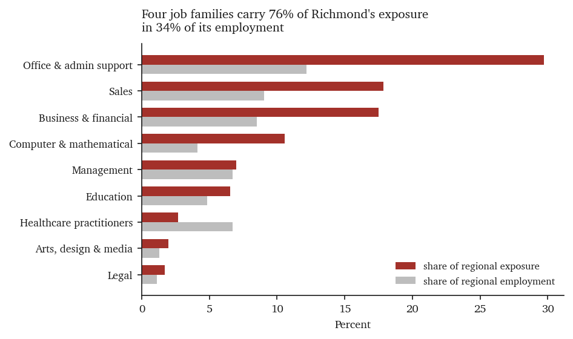
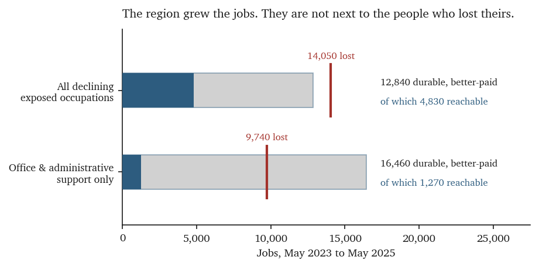
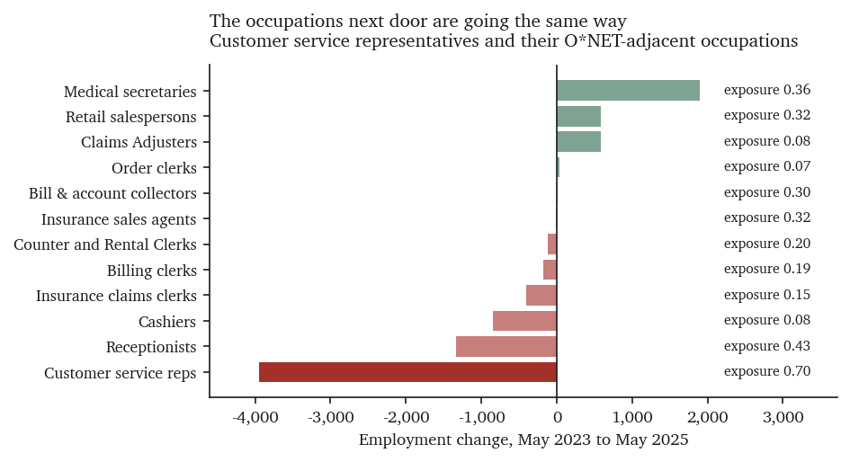
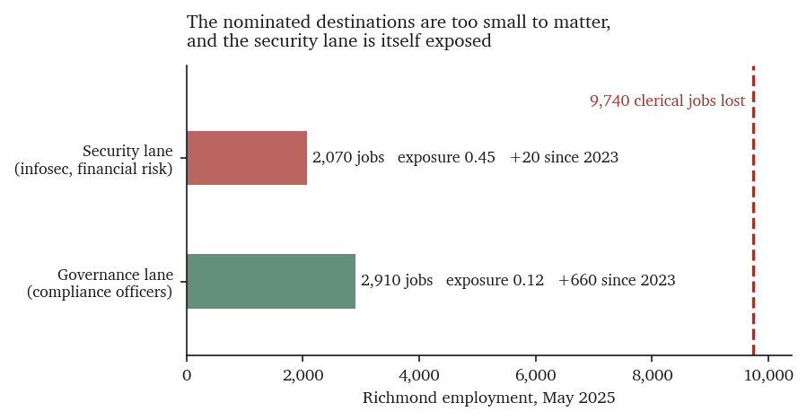
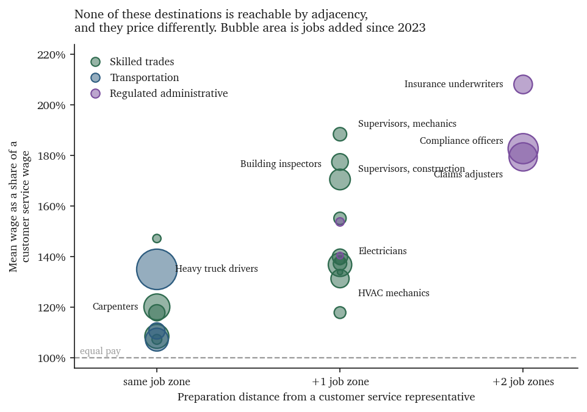
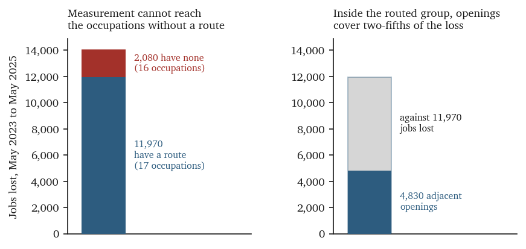

# Transition Capacity in the Richmond Metropolitan Area

**What the occupation-level evidence implies for the AI workforce pilot**

Prepared for the AI Ready RVA Working Group
July 2026

Companion to *AI Exposure and Employment Change in the Richmond Metropolitan Area*.
Supporting tables and reproduction instructions are in the accompanying
[Technical Appendix](technical-appendix.md).

---

## Summary of findings

Three terms carry most of the argument below. **Exposure** is the share of an occupation's
tasks that appear in measured interactions with a large language model; it locates where the
technology is being used, not where jobs are being lost. A destination is **adjacent** to a
displaced worker when the national skills database records substantial overlap between the
two occupations, which indicates transferable skill rather than an easy or likely move.
**Wage replacement** is the destination's mean pay expressed as a percentage of the pay the
worker is leaving, so 100% is a lateral move and anything below it is a pay cut.

1. **Richmond's exposure is concentrated in four job families.** Office and
   administrative support, sales, business and financial operations, and computer
   and mathematical occupations together hold 75.6% of the region's
   exposure-weighted employment while accounting for 33.8% of its jobs. Office and
   administrative support alone carries 29.7% of regional exposure.

2. **The working group's estimate of roughly 240,000 exposed jobs is defensible at
   a stated threshold.** Counting occupations with observed exposure at or above
   0.10 yields 231,390 jobs, 35.0% of metropolitan employment. No other round
   threshold reproduces both the count and the one-in-three share.

3. **The region generated almost exactly enough durable, better-paid hiring to
   replace what it lost — and almost none of it is reachable.** Thirty-three
   exposed occupations shed 14,050 jobs between May 2023 and May 2025. Occupations
   that are growing, low-exposure and at least as well paid added 12,840 jobs over
   the same period, 91% of the loss. Only 4,830 of those additions, 38%, sit in an
   occupation adjacent to any displaced worker. For displaced clerical workers
   specifically the reachable share falls to 8%.

4. **Adjacency fails because the neighboring occupations are failing together.**
   Customer service representatives, the single largest loss at 3,950 jobs, have
   23 related occupations in the O\*NET database. Thirteen are absent from Richmond or too small
   to matter; of the ten present at scale, nine are shrinking, more exposed,
   lower-paid, or some combination. Exactly one destination survives every
   condition.

5. **Wage flexibility does not resolve it.** Permitting a displaced worker to land
   at 80% of prior pay rather than 100% raises the number of covered occupations
   from 17 to 19 of 33. The binding constraint is the absence of adjacent durable
   work, not workers' unwillingness to accept less.

6. **The cyber and risk pathway does not survive measurement, but its governance
   half does.** The security lane named in the pilot plan — information security
   analysts and financial risk specialists — holds 2,070 Richmond jobs, grew by 20
   over two years, and carries mean exposure of 0.45, higher than most of the
   occupations it would receive workers from. Compliance officers, the governance
   destination, hold 2,910 jobs, grew 29.3%, and carry exposure of 0.12.

7. **Applying the plan's own selection criterion returns a different cluster.**
   Regulated administrative and compliance work — compliance officers, claims
   adjusters, insurance underwriters, tax examiners, court and municipal clerks,
   payroll clerks, legal secretaries and eligibility interviewers — holds 8,950
   jobs, added 1,950 over two years, carries mean exposure of 0.08, and pays
   $73,422 on average. It is four times the size of the security lane and grew
   nearly a hundred times as much.

8. **The best available pathway covers a fifth of the loss it addresses.** The six
   clerical occupations that feed this cluster lost 10,030 jobs. The cluster added
   1,950, or 19%. Every pathway that raises pay materially also crosses at least
   one O\*NET job zone, and the strongest one — customer service representative to
   claims adjuster, at 180% wage replacement — crosses two.

9. **This is the affirmative case for the pilot's central bet.** The plan wagers on
   internal redeployment over external retraining. The external market for
   displaced Richmond clerical workers offers 1,270 reachable jobs against 9,740
   lost. Redeployment inside the employer is not merely the preferable channel; it
   is the only one with capacity at the relevant scale.

10. **The unreached capacity is large enough to be worth an instrument, and the
    skilled trades are the cheapest route into it.** For displaced clerical
    workers, 15,190 jobs of durable, better-paid hiring — 92% of what the region
    generated — sit outside every adjacent occupation. Sixteen trades occupations
    added 3,090 jobs at 137% of a customer service wage and a one-job-zone
    preparation gap, and not one of them is adjacent to any displaced occupation.
    The regulated cluster pays more, at 184%, but costs two job zones to reach.
    Both require a funded pathway; neither is reachable unaided.

---

## 1. Scope

This report addresses one question the exposure analysis left open: given what
Richmond has already lost, where can the affected workers go, and how far is it?

It is written to inform the design of the AI Ready RVA workforce transition pilot,
and it engages that plan's stated selection criterion directly — that "the first
pathways are chosen where local AI exposure and local hiring demand overlap most."
That criterion is sound. Applied to May 2025 data, it selects a different set of
destinations than the plan currently names, and the difference is large enough to
matter for program design.

The plan's Appendix A.6 records an open commitment to re-verify role and salary
figures against primary BLS releases and to run a multi-vintage check before
external use. This report is that check, conducted across the May 2023, May 2024
and May 2025 vintages.

---

## 2. Data and method

**Exposure.** Observed-exposure scores for 756 occupations from Anthropic's
occupational exposure dataset, joined to Bureau of Labor Statistics Occupational
Employment and Wage Statistics by Standard Occupational Classification code.[^soc] 523
occupations match Richmond MSA employment. Scores are national constants; they
describe the occupation, not the region.

**Employment, wages and concentration.** BLS OEWS May 2025 metropolitan estimates
for the Richmond VA MSA, area 40060, with May 2024 and May 2023 vintages for
change over time. All employment, wage and location-quotient figures come from the
same release, so cross-sectional comparisons are internally consistent.

**Adjacency.** O\*NET® database 29.2, Related Occupations file, restricted to the
Primary-Short and Primary-Long relatedness tiers. The O\*NET database publishes relatedness
directionally and only 54% of pairs appear in both directions, which discards real
transitions: claims adjusters list customer service representatives as a related
occupation while the reverse edge is absent. Career change runs both ways, so the
analysis takes the union of both directions. This is the assumption least
favorable to the report's central finding, and Section 6 reports the alternative.

**Preparation distance.** O\*NET Job Zones, which classify occupations by the
preparation they require, from zone 1 (little or none) to zone 5 (extensive).
Where a single SOC code spans several O\*NET occupations with different zones, the
highest is used.

**Definitions used throughout.** A *displaced* occupation has observed exposure at
or above 0.25 and lost employment between May 2023 and May 2025. A *destination*
has exposure below 0.15, at least 500 Richmond jobs, employment growth over the
same period, and a mean wage at or above the reference wage. Reference wages are
weighted by jobs lost rather than by surviving employment, because losses
concentrate in the lower-paid occupations within the exposed set and an
employment-weighted wage would overstate what displaced workers earned.

---

## 3. Where the exposure sits

Exposure is not spread evenly across the regional economy. Four job families carry
three-quarters of it.

| Job family | Jobs | Exposed jobs | Share of exposure | Mean exposure | Change 2023–25 | Mean wage |
|:-------------------------------|--------:|--------:|-------:|-------:|--------:|--------:|
| Office & administrative support | 71,030 | 23,603 | 29.7% | 0.332 | −8,780 | $50,539 |
| Sales | 52,780 | 14,167 | 17.8% | 0.268 | −260 | $51,808 |
| Business & financial | 49,740 | 13,893 | 17.5% | 0.279 | +1,770 | $91,242 |
| Computer & mathematical | 23,940 | 8,397 | 10.6% | 0.351 | −1,080 | $117,369 |
| **Top four combined** | **197,490** | **60,060** | **75.6%** | **0.304** | **−8,350** | **$69,231** |

Healthcare practitioners are the clearest inverse: 39,130 jobs, 6.7% of regional
employment, but 2.7% of regional exposure. Transportation and material moving,
the region's second-largest family at 54,980 jobs, carries 0.1%.

The four exposed families are not moving together. Business and financial
operations grew by 1,770 despite the third-highest exposure share, and sales was
essentially flat. The contraction is concentrated in office and administrative
support, which lost 8,780 jobs, and to a lesser degree in computer and
mathematical occupations, which lost 1,080.

### The scale of exposure

The working group has used a figure of roughly 240,000 exposed jobs, about one in
three. That figure is reproducible, but only at a stated threshold.

| Threshold | Occupations | Jobs | Share of metro employment |
|---|---:|---:|---:|
| exposure ≥ 0.05 | 204 | 298,440 | 45.2% |
| **exposure ≥ 0.10** | **150** | **231,390** | **35.0%** |
| exposure ≥ 0.15 | 121 | 191,230 | 29.0% |
| exposure ≥ 0.25 | 71 | 143,640 | 21.8% |
| exposure ≥ 0.40 | 28 | 61,740 | 9.3% |

Exposure at or above 0.10 is the only round cut that lands near both 240,000 jobs
and one in three of the 660,350-job metropolitan total. The figure should be
stated with the threshold attached, because "exposed" carries very different
weight at 0.10 than at 0.40, and the count varies by a factor of nearly four
across the plausible range.

---

## 4. What has already been lost

Thirty-three occupations with exposure at or above 0.25 lost employment between
May 2023 and May 2025, shedding 14,050 jobs carrying $830.2 million in annual
wages. Office and administrative support accounts for 9,740 of those jobs, 69% of
the total.

| SOC | Occupation | Jobs lost | Exposure | Wage |
|:--------|:------------------------------------------------|---------:|--------:|--------:|
| 43-4051 | Customer Service Representatives | 3,950 | 0.70 | $44,520 |
| 43-3031 | Bookkeeping, Accounting & Auditing Clerks | 2,280 | 0.31 | $53,580 |
| 43-4171 | Receptionists & Information Clerks | 1,340 | 0.43 | $36,750 |
| 43-6014 | Secretaries & Administrative Assistants | 1,290 | 0.45 | $48,460 |
| 43-4111 | Interviewers, Except Eligibility & Loan | 770 | 0.39 | $49,870 |
| 43-9021 | Data Entry Keyers | 110 | 0.67 | $41,270 |

Weighted by jobs lost, this population earned $46,480. Across all 33 declining
exposed occupations the loss-weighted wage is $59,092.

Two occupations in office and administrative support moved the other way. Medical
secretaries and administrative assistants grew by 1,900, and general office clerks
by 250. Both remain exposed — 0.36 and 0.45 respectively — so this is displacement
being absorbed within the family rather than exposure being escaped.

---

## 5. The central finding: capacity exists, reach does not

The region did not stop creating good jobs. Occupations that are growing,
low-exposure and at least as well paid as the displaced population added 12,840
jobs between May 2023 and May 2025 — 91% of everything the exposed occupations
shed. Measured against clerical losses alone, the figure is 16,460, or 169%.

Almost none of it is next to the people who lost their jobs.

| Population | Jobs lost | Durable better-paid hiring | Adjacent | Reachable share of capacity |
|:-----------------------------------------|--------:|--------:|--------:|--------:|
| All declining exposed occupations | 14,050 | +12,840 | +4,830 | 38% |
| Office & administrative support only | 9,740 | +16,460 | +1,270 | 8% |

For displaced clerical workers, the region generated 16,460 durable, better-paid
job openings and placed 1,270 of them within reach. That is 13% of what was lost.

Two qualifications make this an upper bound rather than an estimate. Growth in
these destinations is not reserved for displaced workers; it is hiring the entire
regional labor market competes for, including new entrants and in-migrants. And
adjacency in the O\*NET database indicates skill overlap, not that a transition is short, cheap
or likely.

---

## 6. Why adjacency fails

The reason is visible in the largest single case. Customer service
representatives lost 3,950 jobs. The O\*NET database records 23 related occupations. Thirteen
are absent from Richmond or fall below 500 jobs. Of the ten present at scale, nine
fail at least one condition.

| Adjacent occupation | Exposure | Change | Wage | Fails |
|:-------------------------------------------|--------:|-------:|-------:|:--------------------------|
| Insurance Claims & Policy Processing Clerks | 0.15 | −400 | $45,800 | shrinking |
| Billing & Posting Clerks | 0.19 | −180 | $49,780 | exposed, shrinking |
| Receptionists & Information Clerks | 0.43 | −1,340 | $36,750 | exposed, shrinking, pays less |
| Bill & Account Collectors | 0.30 | +10 | $46,640 | exposed |
| Cashiers | 0.08 | −850 | $31,910 | shrinking, pays less |
| Counter & Rental Clerks | 0.20 | −120 | $50,050 | exposed, shrinking |
| Retail Salespersons | 0.32 | +580 | $35,460 | exposed, pays less |
| Insurance Sales Agents | 0.32 | −10 | $77,940 | exposed, shrinking |
| Medical Secretaries | 0.36 | +1,900 | $44,230 | exposed, pays less |
| **Claims Adjusters, Examiners & Investigators** | **0.08** | **+580** | **$79,920** | **— viable** |

Only one of the ten survives every condition. Six are shrinking, three grow but pay
less than the role being left, and the exception pays well and is barely exposed. The
neighbourhood is not uniformly contracting — medical secretaries added 1,900 jobs and
retail salespersons 580 — but growth in the neighbourhood is concentrated in work that
pays less than customer service already does. Sideways movement into lower-paid work is
not a transition.

Across all 33 declining exposed occupations, 16 have no destination that satisfies
every condition, accounting for 2,080 of the 14,050 jobs lost.

### Wage flexibility does not close the gap

A common assumption is that displaced workers can be absorbed if they accept less.
The data does not support it.

| Wage floor | Occupations covered | Pathways | Gross destination capacity |
|---|---:|---:|---:|
| 100% of prior pay | 17 of 33 | 28 | +6,350 |
| 90% | 18 of 33 | 35 | +7,770 |
| 80% | 19 of 33 | 39 | +10,320 |

Cutting the wage-replacement requirement by a fifth adds two covered occupations.
The constraint is the absence of adjacent durable work, not the wage.

### Sensitivity to the adjacency assumption

Reading the O\*NET relatedness data exactly as published, without adding the reverse
edges, narrows the reachable set considerably. The direction of the finding is
unchanged.

| Population | Symmetric adjacency | As published |
|---|---:|---:|
| All declining exposed occupations | +4,830 | +3,170 |
| Office & administrative support | +1,270 | +330 |

The figures in Section 5 use the symmetric treatment throughout.

---

## 7. The nominated pathway, measured

The pilot plan names cyber and risk as its first pathway, with six source roles
feeding two lanes, Governance and Risk, and Security. Measured against Richmond
employment, the two lanes behave very differently.[^hiring]

| Lane | Occupations | Jobs | Change 2023–25 | Mean exposure | Mean wage |
|:-----------|:-----------------------------------------|-----:|--------:|-------:|--------:|
| Security | Information security analysts, financial risk specialists | 2,070 | +20 | 0.45 | $125,596 |
| Governance | Compliance officers | 2,910 | +660 (+29.3%) | 0.12 | $81,370 |

Three findings bear on the security lane. It is small: 2,070 jobs against 9,740
clerical jobs lost. It is static: it added 20 positions in two years. And it is
itself exposed at 0.45, higher than every clerical occupation that would feed it
except customer service representatives and data entry keyers. Information
security analysts score 0.486 — a destination roughly as exposed as the work being
left behind.

The governance lane is the opposite on every measure. Compliance officers grew
29.3% in two years, carry exposure of 0.12, run at 1.64 times national
concentration, and pay $81,370. This is the strongest single destination
occupation in the Richmond data, and the plan identified it.

A fourth finding concerns the source roles rather than the destinations. The five
named source occupations that appear in OEWS — IT auditor, help desk, systems
analyst, systems administrator, business analyst — hold 21,260 Richmond jobs and
lost 210 between them, a decline of 1%. They are professional roles paying
$64,990 to $113,840. They are not, on this evidence, the population being
displaced. The pathway as specified routes workers who mostly still have jobs
toward a destination that is small and exposed, while the 10,030 clerical jobs
that actually disappeared are not addressed.

---

## 8. What the criterion selects instead

Richmond is a state capital and an insurance and finance center. Applying the
plan's own test — exposure and hiring demand overlapping — returns the occupations
where those two facts meet: regulated administrative and compliance work.

| SOC | Occupation | Jobs | Change | Exposure | LQ | Wage | Zone |
|:--------|:-------------------------------------------|------:|------:|-----:|-----:|-------:|----:|
| 13-1041 | Compliance Officers | 2,910 | +660 | 0.12 | 1.64 | $81,370 | 4 |
| 13-1031 | Claims Adjusters, Examiners & Investigators | 1,790 | +580 | 0.08 | 1.30 | $79,920 | 4 |
| 13-2053 | Insurance Underwriters | 950 | +250 | 0.06 | 2.11 | $92,670 | 4 |
| 43-4031 | Court, Municipal & License Clerks | 860 | +330 | 0.10 | 1.12 | $46,500 | 2 |
| 43-4061 | Eligibility Interviewers, Government Programs | 680 | 0 | 0.06 | 1.04 | $56,040 | 3 |
| 43-3051 | Payroll & Timekeeping Clerks | 630 | +50 | 0.05 | 0.97 | $58,960 | 3 |
| 13-2081 | Tax Examiners, Collectors & Revenue Agents | 570 | +30 | 0.03 | 2.38 | $62,560 | 3 |
| 43-6012 | Legal Secretaries & Administrative Assistants | 560 | +50 | 0.00 | 0.84 | $68,480 | 3 |
| | **Total** | **8,950** | **+1,950** | **0.08** | | **$73,422** | |

Against the security lane's 2,070 jobs and 20 additions, this cluster is four
times the size and grew ninety-seven times as much. Six of its eight occupations
run above national concentration, two of them above 2.0 — insurance underwriters
at 2.11 and tax examiners at 2.38 — which is the signature of an employer base
that already exists locally rather than one that must be recruited.

### The pathways, with wage replacement and preparation distance

| From | To | Wage repl. | Job zones | Growth |
|:--------------------------------|:---------------------------------------|-------:|:---------|-------:|
| Receptionists | Legal Secretaries & Admin Assistants | 186% | 2 to 3 | +50 |
| Customer Service Representatives | Claims Adjusters | 180% | 2 to 4 | +580 |
| Insurance Claims & Policy Clerks | Claims Adjusters | 174% | 2 to 4 | +580 |
| Secretaries & Admin Assistants | Legal Secretaries & Admin Assistants | 141% | 2 to 3 | +50 |
| Receptionists | Court, Municipal & License Clerks | 127% | 2 to 2 | +330 |
| Secretaries & Admin Assistants | Payroll & Timekeeping Clerks | 122% | 2 to 3 | +50 |
| Bookkeeping Clerks | Tax Examiners & Revenue Agents | 117% | 3 to 3 | +30 |
| Bookkeeping Clerks | Payroll & Timekeeping Clerks | 110% | 3 to 3 | +50 |
| Insurance Claims & Policy Clerks | Court, Municipal & License Clerks | 102% | 2 to 2 | +330 |

The strongest pathway in the entire Richmond dataset is customer service
representative to claims adjuster: 180% wage replacement, into an occupation with
exposure of 0.08 that grew 48% in two years and runs at 1.30 times national
concentration. It also crosses two job zones, from "some preparation needed" to
"considerable preparation needed." That is not a weeks-long transition, and it
should not be planned as one.

The six clerical occupations feeding this cluster lost 10,030 jobs. The cluster
added 1,950 — 19%. This is the best available set of pathways in the region, and
it addresses a fifth of the problem it is pointed at.

---

## 9. Implications for the pilot

**The redeployment bet is correct, and this is the evidence for it.** The plan
wagers on internal redeployment over external retraining, citing a JPMorgan
announcement and the null result from the Trade Adjustment Assistance evaluation.
Both are about other places. The regional evidence is stronger than either: the
external market offers displaced Richmond clerical workers 1,270 reachable
durable, better-paid positions against 9,740 jobs lost. Internal redeployment is
not the preferable channel. At this scale it is the only one.

**The first pathway should be regulated administrative and compliance work.** The
governance half of the nominated pathway survives measurement and should be kept.
The security half does not and should be dropped: 2,070 jobs, 20 added in two
years, and mean exposure of 0.45 in the destination. Widening governance to
include claims adjusting, insurance underwriting, court and municipal
administration, and tax examination produces a cluster four times the size with
the same low exposure.

**Source roles should follow the losses.** The plan's six source roles lost 1% of
their employment over two years. The clerical occupations feeding the recommended
cluster lost 28%. Pathway design that begins with IT professionals is serving a
population that has not yet been displaced, using capacity that displaced workers
need.

**Tier 3 is the modal case, not the residual one.** The plan defers Tier 3 —
workers with no employer — as not yet designed. The largest single loss in the
region is 3,950 customer service representatives, an occupation with exactly one
viable adjacent destination and a two-zone preparation gap to reach it. Workers
separated from those roles are Tier 3 by definition. The tier the plan designs
last is the tier the evidence says is largest and hardest.

**Plan for preparation distance, not proximity.** Every pathway that materially
raises pay crosses at least one job zone, and the highest-value one crosses two.
The plan's estimates of weeks for IT auditor to governance and about a quarter for
business analyst, data analyst and project manager describe transitions between
professional roles at the same preparation level. Clerical-to-professional
transitions are a different problem, and pricing them at the same duration will
understate what the pilot costs.

**The North Star metric is measurable now.** The plan defines worker mobility as
landing equal-or-better, measured by wage-replacement rate. That rate can be
baselined today from OEWS: $46,480 loss-weighted for displaced clerical workers,
$59,092 across all declining exposed occupations. Every pathway in Section 8
carries a computed replacement rate. The pilot can be evaluated against a
pre-registered regional baseline rather than a self-reported one.

---

## 10. Instruments for closing the reach gap

Sections 5 and 6 establish a diagnosis rather than a recommendation: the region
generates enough durable, better-paid work to cover its losses, and displaced
workers cannot reach most of it. That unreached capacity is the quantity any
intervention has to act on, and it can be stated directly.

| Population | Durable better-paid hiring | Adjacent | Not adjacent | Share not adjacent |
|:-----------------------------------------|--------:|--------:|--------:|--------:|
| All declining exposed occupations | +12,840 | +4,830 | +8,010 | 62% |
| Office & administrative support only | +16,460 | +1,270 | +15,190 | 92% |

For displaced clerical workers, 92% of the durable, better-paid hiring the region
produced sits outside every occupation the O\*NET database records as related to
their own. Adjacency is not a barrier employers or funders can remove; it is a
description of how far apart two kinds of work are. What can be changed is
whether a worker crosses that distance alone.

Two destination classes account for a substantial share of the unreached
capacity, and they are not interchangeable.

### 10.1 Employer transition compacts

The mechanism is an agreement between a releasing employer and a receiving
employer, convened by a neutral third party: the releasing employer funds
training for workers it is separating, and the receiving employer commits a role
to workers who complete it to a standard it sets. What the compact supplies is
not money and not curriculum. It is the information and the commitment that
adjacency would otherwise have to provide.

The clearest case for it appears in Section 6. The O\*NET database records claims
adjusters as related to customer service representatives, while the reverse
relationship is absent from the published file. A displaced customer service
representative searching outward from their own occupation does not find claims
adjusting. An employer that staffs both functions already knows the work
transfers, and claims adjusting pays $79,920 against $44,520 — 180% wage
replacement, in an occupation that grew 580 jobs and runs at 1.30 times national
concentration. The same asymmetry recurs across the regulated cluster: measured
against the clerical displaced population specifically, neither compliance
officers nor insurance underwriters are adjacent to any occupation that lost
jobs, though both clear every durability, growth and wage test.

Three design questions determine whether such an arrangement works.

**Who a compact should serve.** The displaced population is concentrated at the
bottom of the wage distribution, and so is the available capacity. Exposed
occupations paying under $60,000 account for 10,850 of the 14,050 jobs lost.
Exposed occupations paying $90,000 or more account for 1,430. Destination options
thin out sharply at the top: a displaced software developer at $139,340 has seven
qualifying destinations in the region with 940 jobs of combined growth, and a
personal financial advisor at $158,910 has five. A compact built around
high-earning professionals would serve a tenth of the displacement using the
thinnest part of the capacity, and would deliver wage cuts rather than
replacement. The instrument belongs at the clerical end, where both the losses
and the destinations are largest.

**How the receiving employer avoids adverse selection.** If the releasing
employer selects who enters training and the role is guaranteed on completion,
the receiving employer bears the full cost of any selection it cannot observe,
and will price that risk into its willingness to participate. A guaranteed role
combined with a screening interview does not resolve this, because the two
provisions contradict each other: an interview with authority to reject makes the
guarantee conditional in a way the worker cannot plan around, and an interview
without it screens nothing. The resolution is to move the selection to the point
of entry. The receiving employer co-selects the training cohort and defines the
completion standard; the role is then committed to anyone meeting that standard;
the releasing employer funds the cohort irrespective of individual outcomes. The
worker receives certainty at admission, which is when it has planning value, and
the receiving employer screens before it commits rather than after.

**What keeps it lawful.** Agreements among employers that touch hiring are
scrutinized, and agreements not to recruit each other's workers have been treated
as criminal offenses since 2016. A compact moving involuntarily separated workers
toward employment is structurally the opposite of a restraint, but it needs to be
constructed so that it cannot be characterized as one. The design features that
matter are a neutral convener rather than direct employer-to-employer
negotiation, published participation criteria open to any employer meeting them,
no coordination of wages and no exchange of compensation data, no reciprocal
undertaking to refrain from recruiting, hiring decisions that remain individual
to each employer, and eligibility restricted to workers already under
separation.[^counsel]

The realistic scale of a compact is a cohort, not a labor market. Twenty to fifty
workers per cycle is a demonstration against 14,050 jobs lost. Its value is that
it produces a documented placement rate and a documented wage-replacement rate
for a transition the adjacency data says should not happen, which is evidence no
amount of further analysis of published data can generate.

### 10.2 Trades, technical services and the destinations this data cannot see

Sixteen occupations in construction, extraction, installation, maintenance and
repair clear every screen applied in Section 5 against the clerical reference
wage. They added 3,090 jobs between May 2023 and May 2025, carry an
employment-weighted mean exposure of 0.018, and **none of the sixteen is adjacent
to any displaced occupation.** They are, in other words, entirely invisible to
the pathway logic that Sections 5 through 8 apply.

| Destination | Jobs | Change | LQ | Wage | Wage repl. | Zone |
|:-----------------------------------|-----:|-----:|----:|--------:|----:|----:|
| First-line supervisors, mechanics | 2,980 | +130 | 1.14 | $83,910 | 188% | 3 |
| First-line supervisors, construction | 4,460 | +200 | 1.29 | $79,030 | 178% | 3 |
| Construction & building inspectors | 1,140 | +310 | 1.83 | $75,950 | 171% | 3 |
| Industrial machinery mechanics | 1,900 | +110 | 1.02 | $69,110 | 155% | 3 |
| Electricians | 3,600 | +170 | 1.12 | $62,360 | 140% | 3 |
| Bus & truck mechanics | 1,400 | +60 | 1.14 | $61,740 | 139% | 3 |
| Automotive service technicians | 2,930 | +130 | 0.98 | $61,160 | 137% | 3 |
| Plumbers & pipefitters | 2,340 | +400 | 1.18 | $60,940 | 137% | 3 |
| HVAC mechanics | 2,700 | +240 | 1.55 | $58,490 | 131% | 3 |
| Carpenters | 3,070 | +490 | 1.08 | $53,520 | 120% | 2 |

Wage replacement is measured against a customer service representative at
$44,520, the largest single loss in the region. Heavy and tractor-trailer truck
drivers sit adjacent to this group and warrant separate mention: 11,760 jobs,
1,190 added, 1.34 times national concentration, $60,130, and job zone 2 — the
same preparation level as the occupation losing the most jobs.

The comparison with the regulated cluster is the substantive finding.

| Destination class | Jobs added | Mean wage | Wage repl. | Preparation distance |
|:-------------------------------------|--------:|--------:|----:|:---------|
| Regulated administrative & compliance | +1,570 | $81,864 | 184% | +2 job zones |
| Skilled trades | +3,090 | $60,874 | 137% | +1 job zone |

The regulated figures here cover the five occupations in the Section 8 cluster
that both grew and pay at or above the clerical reference wage, which is why the
job count is lower than the 1,950 reported for the full eight-occupation cluster.
Preparation distance is the largest job-zone gap in each class measured from job
zone 2, where customer service representatives sit.

The regulated cluster returns more and costs more to reach. The trades return
about a third more pay at half the preparation distance, and roughly twice the
volume of openings. Neither dominates, and the reason to hold both is that they
serve different people: a worker who can absorb a two-zone transition, financially
and otherwise, has the higher-value destination available, and a worker who cannot
is currently being offered nothing. The recommendation in Section 9 that the first
pathway be regulated administrative work stands on value per placement. It should
not be read as implying that the trades are a lesser destination for workers who
cannot fund two years of preparation while displaced.

Two caveats bear directly on this class, and both cut against it.

The exposure measure is derived from language-model interactions. It cannot
observe robotics, computer vision or autonomous vehicles, so a score of 0.018
across the trades and 0.00 for truck driving records absence from the sampled
conversations, not immunity to automation.[^robotics] Truck driving in particular
carries automation risk that this dataset is structurally incapable of measuring,
and its 1,190 added jobs should not be read as a durability finding.

OEWS is an establishment survey of wage and salary workers in nonfarm
establishments; it excludes the self-employed, owner-operators and unpaid family
workers. Every destination in this report is therefore a payroll job. The trades
are the destination class most often entered through owner-operation, which means
the capacity measured above understates them by an amount this data cannot bound.
It also means an instrument aimed at self-employment — licensure costs, tools,
bonding, working capital during the unpaid ramp — targets a destination the
analysis cannot see at all, and that a program designed strictly from this
evidence would systematically under-fund.

### 10.3 Measurement, and what it can and cannot resolve

Both instruments above assume something this report cannot supply: a way to tell which
individual worker is close to which destination. Section 6 establishes adjacency between
*occupations*, using O\*NET's national skill-overlap records. It says nothing about a
person. Two bookkeeping clerks with identical job titles may sit at very different
distances from the same destination, and nothing in this evidence base distinguishes them.
That is the gap a measurement partner would fill, and it is the report's most consequential
unmet need for anyone trying to place a specific person rather than describe a population.

A phased architecture for closing it has been proposed to the coalition by ETS, a nonprofit
educational measurement organization. Its structure is sound and worth stating in the terms
its authors use. First, measure both sides of the market: a skills and job-task analysis
with employers establishing what target roles genuinely require, and a readiness assessment
of the populations the region is trying to move. Second, compute the gap between the two for
any individual against any role, turn that gap into a concrete next step, and aggregate the
result to whatever altitude a stakeholder needs. Third, put the recommendations in front of
the people who can act on them. The argument attached to it is that the three phases descend
in specialization and ascend in ease, so the measurement layer is both the hardest to build
and the thing every downstream decision's credibility rests on.

Two points from this report's own evidence qualify that argument, and both narrow where
measurement should be aimed rather than diminishing its value.

The first concerns sequencing. A coarse version of the second phase does not wait on the
first. Sections 5 through 8 compute occupation-level gaps and rank destinations by wage
replacement and preparation distance using only public federal data, with no assessment
instrument built. That version is already sufficient to decide which transitions are worth
attempting and which are not, which is why this report can recommend against the nominated
pathway in Section 7. Individual-level measurement is required to decide *who* moves, not
*whether* a route exists.

The second concerns what better measurement can deliver, and it divides the loss into two
groups that call for different responses. Of the 33 declining exposed occupations, 17 have
at least one adjacent destination that is durable and better paid, accounting for 11,970 of
the jobs lost. The remaining 16, accounting for 2,080 jobs, have none at any wage floor
tested. No assessment can help the second group, because the constraint sits on the
destination side of the market rather than in what the worker can demonstrate. Within the
first group the constraint is different again: adjacent openings number 4,830 against 11,970
jobs lost, so even a perfectly targeted transition program is working against a shortfall
of roughly three jobs in five.

Measurement is therefore necessary for targeting and insufficient for outcomes. The
distinction matters most when budgeting, because a region-wide readiness census would spend
much of its cost measuring people for whom no destination exists. A first engagement aimed
at the routed group is smaller, cheaper and easier to prove, and it is where knowing which
workers are genuinely close changes a decision someone is about to make. It is also where
ETS's material meets this report's weakest inference directly: identifying residents who are
closer to in-demand roles than their credentials suggest is precisely what occupation-level
adjacency cannot establish.

The terms ETS proposes are favorable and should be recorded. It describes itself as a
neutral measurement partner rather than a training vendor, staffing intermediary or
employer with a stake in outcomes. It proposes that the region retain control of its data,
that the system launch in an advisory posture before any gatekeeping use, and that the
result be a public asset governed by the region. It also proposes phased engagement
beginning with a single transition pathway and a bounded set of employers, which matches
the pilot scoping this report's evidence supports.

**Delivery and credentialing.** A measurement layer produces evidence of capability. It does
not by itself train anyone or give the result currency with an employer who was not part of
the design. The proposal under discussion assigns in-person delivery and local advocacy to
VCU's Office of Continuing and Professional Education, and ownership of the resulting
credential to external bodies, with the Linux Foundation and OpenAI named. Separating the
local champion from the credential owner is the strongest structural idea in the proposal:
a credential issued by one university carries little weight outside its region, while an
externally owned standard delivered locally can carry both portability and local
legitimacy.

VCU has a relevant track record. Its AI Pioneer Training Program, developed with Luck
Companies, combines collaborative workshops with a capstone project and is open to
participants from front-line managers to senior executives with no technical background.
That demonstrates VCU can co-design and deliver employer-specific AI instruction, which is
a genuine asset and the closest thing in the region to a working precedent.

It is not, however, the same product as what this report's findings require, and the
distinction should be explicit. The AI Pioneer program teaches fluency to workers
continuing in their current roles — the ability to evaluate tools and improve existing
workflows. The population in Section 4 is leaving its occupation and needs to hold a
different job at comparable pay. Luck Companies is also an aggregates business, so its
occupational mix bears little resemblance to the clerical roles that account for 9,740 of
the jobs lost. What is proposed is therefore an extension of the VCU program into a
different population and a different outcome measure, not a repetition of it, and it should
be presented that way to anyone asked to fund it.

Set out as an architecture, the arrangement assigns eight roles, and the distance between
what is established and what is proposed is wide enough that it should be visible at a
glance rather than inferred from the prose.

| Role | Who | Status |
|:-----|:----|:-------|
| Assessment design and validation | ETS | Capability established; authorization unknown |
| Employer role mapping[^crosswalk] | ETS | Capability established; authorization unknown |
| Occupational transition evidence | AI Ready RVA | In hand |
| In-person training delivery | VCU continuing education | Demonstrated, on fluency rather than transition |
| Local advocacy for the credential | VCU | Proposed |
| Credential ownership | Linux Foundation and OpenAI | No contact established |
| Employer use case and role definitions | An exposed regional employer | None approached |
| Funding and model access | OpenAI | Not approached |

Five of the eight rows are proposals rather than commitments. That is a reasonable state for
a concept at this stage, but it means the architecture cannot be presented to a funder as
though the consortium exists. One conversation has taken place.

Two open questions bear on the design rather than on its execution. The first is who the
pilot employer would be. This report identifies where exposure sits by industry and
occupation, but the mapping from occupation to a named firm is inference from industry
staffing patterns rather than a measurement of any employer, so nothing here nominates a
participant. The second concerns credential ownership. The Linux Foundation positions its
certification work as deliberately vendor-neutral, while OpenAI is a model provider
developing its own certification program with ETS and Pearson supplying the assessment
design. How a jointly owned credential would sit alongside that program is a question for
the parties to answer before the design is treated as settled.

### 10.4 What these instruments do not address

Both instruments convert unreached capacity into reachable capacity for workers
who can undertake a transition. Neither addresses the residual. Sixteen of the 33
declining exposed occupations, accounting for 2,080 jobs lost, have no destination
that satisfies every condition at any wage floor tested in Section 6, and
destination capacity is in any case not reserved for displaced workers. A regional
strategy that consists only of transition pathways is therefore incomplete by the
measure of its own evidence, and the interventions that would address the
remainder — income support, community investment, and the funding of destinations
this data cannot observe — sit outside the scope of an occupational analysis and
should be argued on their own terms rather than inferred from these tables.

[^crosswalk]: The tool that would hold this mapping — current role, target role,
    competency gap, verified readiness — carries the working name Crosswalk within the
    coalition. It is described functionally here because "crosswalk" also denotes the
    mapping between successive revisions of the occupational classification, which appears
    elsewhere in this report's method, and one term should not carry both meanings.

[^counsel]: This section describes design constraints, not a legal opinion, and
    no part of it should be treated as clearing a specific arrangement. Any
    compact involving more than one employer warrants antitrust counsel before
    execution, and the presence of federal funding in the convening organization
    raises separate questions about cost allocation that counsel should address at
    the same time.

[^robotics]: This is the most consequential limitation for the destinations
    recommended in this section. The Anthropic measure is built from observed
    language-model conversations, so it registers exposure to text and reasoning
    automation. Occupations exposed primarily to physical automation are
    indistinguishable in this data from occupations facing no automation at all.
    A separate measure would be required to assess the trades on durability, and
    none of comparable construction is currently available for Richmond.

---

## 11. Limitations

1. **Exposure scores are national constants.** They describe occupations, not
   Richmond. Any regional differential in this report is occupational composition,
   never local intensity of AI use.

2. **Zero scores are common and may understate exposure.** Of the 756 occupations
   in the source dataset, 411 score exactly zero, reflecting absence from the
   sampled interactions rather than demonstrated absence of exposure. Several
   destinations in Section 8 sit at or near zero. Their apparent durability rests
   partly on absence of evidence.

3. **OEWS is not designed for cross-year comparison.** BLS states this directly.
   Estimation methodology, industry composition and response patterns change
   between vintages, and the metropolitan boundary itself changed with the May 2024
   release. Individual year-over-year changes in small occupations should not be read
   as precise. Movement across three consecutive vintages adds less confidence than it
   appears to, because consecutive vintages share four of their six underlying survey
   panels and one discrete event therefore propagates through three of them. The
   largest declines here are credible because they are many times their own published
   sampling error, not because they repeat.

4. **Correlation is not attribution.** This report does not establish that AI
   caused the contraction it measures. Interest rates, post-pandemic normalization,
   offshoring and firm-specific restructuring all bear on clerical employment over
   this period. What the data supports is that a small number of exposed clerical
   occupations contracted sharply while the metropolitan total grew. It does not
   support the stronger reading that decline tracks exposure: exposure score does not
   predict which occupations declined, and exposed occupations elsewhere in the region
   added 6,230 jobs over the same period. The displaced population this report sizes
   is drawn from the declining occupations specifically, not from exposed work in
   general.

5. **Adjacency is a skills relationship, not a probability.** O\*NET relatedness
   indicates overlap in tasks, knowledge and abilities. It does not measure how
   often the transition occurs, how long it takes, or whether employers hire across
   it. A pathway that passes every screen here may still fail in practice for
   reasons this data cannot see, including employer preference and credentialing.

6. **Destination capacity is not reserved.** Growth in a destination occupation is
   hiring the whole labor market competes for. Treating it as absorptive capacity
   for displaced workers is an upper bound, and a generous one.

7. **The 500-job floor excludes small destinations.** Occupations below that
   threshold are set aside as too small to absorb meaningful numbers, which may
   omit viable niche pathways.

8. **The exposure measure cannot see physical automation.** It is built from
   observed language-model conversations. Robotics, computer vision and
   autonomous vehicles leave no trace in it, so occupations exposed to physical
   automation are indistinguishable here from occupations facing none. This
   affects the durability of the trades and transportation destinations in
   Section 10 more than any other finding in the report.

9. **Self-employment is outside the data entirely.** OEWS surveys establishments
   and covers wage and salary workers in nonfarm establishments only, excluding
   the self-employed, owner-operators and unpaid family workers. Every
   destination reported here is a payroll job. Owner-operation is a common route
   into the licensed trades, so both the losses and the destination capacity in
   that direction are unmeasured.

---

## 12. Claims outside this evidence base

Three claims circulate alongside this work and carry more weight than the evidence
behind them. This analysis does not support them.

- **The National Workforce Transition Fund is not available money.** The Act was
  introduced as S. 5055 on 21 July 2026 and referred to the Committee on Finance,
  with Senator Warner as sole sponsor and no cosponsors recorded at introduction.
  It is introduced legislation, not enacted law. Legislative status is perishable,
  so status, cosponsors and committee action warrant rechecking on Congress.gov
  before the bill is cited.
- **Dates, deadlines and attributions relating to convening, roundtables and
  commitments by federal offices or AI companies have no traceable public record.**
  They require primary sourcing before use.
- **Role and salary figures drawn from working-group presentations are superseded
  by the measured values here.** Where those figures concern cyber occupations,
  Section 7 gives the measured Richmond values.

None of these affect the occupational findings in this report, which rest entirely
on published BLS, O\*NET and Anthropic data.

---

## 13. Sources

**Anthropic.** Occupational exposure dataset, `labor_market_impacts/job_exposure.csv`,
756 occupations with observed-exposure scores. Anthropic Economic Index repository,
Hugging Face (`Anthropic/EconomicIndex`), file created 5 March 2026, retrieved July
2026. Published alongside *Labor Market Impacts of AI: A New Measure and Early
Evidence*. Observed exposure is derived by Anthropic from the O\*NET task taxonomy,
Anthropic usage data, and the task-level capability estimates of Eloundou et al. (2023).

**U.S. Bureau of Labor Statistics.** Occupational Employment and Wage Statistics.
- May 2025 Metropolitan and Nonmetropolitan Area estimates (`oesm25ma`), Richmond VA MSA, area 40060
- May 2025 National estimates (`oesm25nat`)
- May 2024 Metropolitan and Nonmetropolitan Area estimates (`oesm24ma`)
- May 2023 National estimates (`oesm23nat`)

**O\*NET Resource Center.** O\*NET® Database 29.2. Related Occupations file
(relatedness tiers) and Job Zones file (preparation requirements), U.S. Department
of Labor, Employment and Training Administration.

**Board of Governors of the Federal Reserve System.** SR 26-2, Model Risk
Management, April 17, 2026, superseding SR 11-7 — cited in Section 7 in relation
to governance demand.

**Mathematica Policy Research.** Trade Adjustment Assistance Evaluation, prepared
for the U.S. Department of Labor — cited in Section 9 as the retraining benchmark.

**ETS.** *Talent Intelligence for Strategic Workforce Planning: Executive Summary of
ETS Capabilities*, prepared for municipal workforce leadership, July 2026; and *AI
Ready RVA: From Measurement to Opportunity — a phased approach*, discussion draft,
July 2026. Both provided to the coalition by Kennon Harrison. Cited in Section 10.3
as a described capability and a proposed architecture, neither authorized nor
committed.

**Virginia Commonwealth University.** Office of Continuing and Professional Education,
AI Pioneer Training Program, developed with Luck Companies —
`ocpe.vcu.edu/what-we-offer/interest/technology/ai`, retrieved July 2026.

**OpenAI.** *Expanding economic opportunity with AI*, 4 September 2025 —
`openai.com/index/expanding-economic-opportunity-with-ai`, for the certification
program, its employer partners, and the roles of ETS and Pearson in assessment design.

### Licensing and attribution

Every dataset underlying this report is either a public-domain U.S. government work
or licensed for reuse, including commercial reuse, with attribution. No proprietary,
confidential, or personal data is used.

Material from the Bureau of Labor Statistics is in the public domain as a work of the
U.S. federal government. BLS is cited as the source of all employment, wage, and
location-quotient figures. This report is not endorsed by, and does not carry the
emblem of, the Bureau of Labor Statistics.

This report includes information from the O\*NET 29.2 Database by the U.S. Department
of Labor, Employment and Training Administration (USDOL/ETA). Used under the
[CC BY 4.0](https://creativecommons.org/licenses/by/4.0/) license. O\*NET® is a
trademark of USDOL/ETA. This analysis has modified some of that information: primary
relatedness pairs, published directionally, are treated here as symmetric, and
O\*NET-SOC codes are aggregated to six-digit SOC codes by minimum relatedness tier and
highest job zone. USDOL/ETA has not approved, endorsed, or tested these modifications.
Section 6, under *Sensitivity to the adjacency assumption*, reports how the symmetry
assumption changes the results.

The Anthropic Economic Index dataset is released by Anthropic under
[CC BY 4.0](https://creativecommons.org/licenses/by/4.0/). Attribution is required and
given above. Anthropic has not reviewed or endorsed this analysis, and the joins,
screens, and conclusions here are solely those of the authors.

The Greater Richmond Partnership employer list is a third-party compilation, cited for
individual headcount figures rather than reproduced.

---

*Analysis and figures are reproducible from the scripts in `scripts/`. Occupation-level
tables and detailed method notes are in the [Technical Appendix](technical-appendix.md).*

[^soc]: The Standard Occupational Classification is the federal coding scheme; the
O\*NET database is a separate product that attaches task, skill and preparation content
to an extended version of it. The two are joined here by truncating the eight-digit
O\*NET-SOC codes to six-digit SOC, which collapses 923 O\*NET occupations onto 798 SOC
codes.

[^hiring]: Employment levels show how large a destination is, not whether it is
hiring people from outside its own field. Whether these lanes would accept a candidate
whose experience is clerical is a question for the employers that staff them, and it
is the assumption on which the pathway rests.
